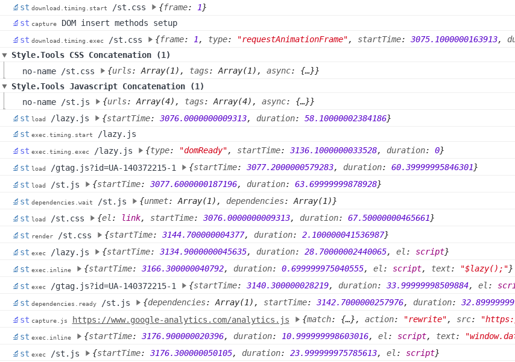

[](https://travis-ci.com/style-tools/async) [](https://github.com/style-tools/async/releases) [](http://badge.fury.io/js/%40style.tools%2Fasync) [](https://packagist.org/packages/styletools/async)

# `$async` Async CSS and Script Loader

A lightweight and high performance async CSS and script loader. 

```javascript
// simple: stylesheet
$async('sheet.css').then(function() { /* ready */ });

// simple: script
$async.js('script.js').then(function() { /* ready */ });
```

```html
<!-- JSON config on script element to support advanced config and strict security -->
<script async src="js/async-iife.js" data-c='[
   [
      "css/sheet1.css",
      {
         "href": "https://cdn.com/css/sheet2.css",
         "attributes": {
            "integrity": "sha384-oqVuAfXRKap7fdgcCY5uykM6+R9GqQ8K/uxy9rx7HNQlGYl1kPzQho1wx4JwY8wC",
            "crossorigin": "anonymous"
         }
      }
   ],
   {
      "render_timing": "requestAnimationFrame"
   },
   0,0,
   [
      "js/script.js",
      {
         "href": "https://cdn.com/js/script2.js",
         "attributes": {
            "integrity": "sha384-oqVuAfXRKap7fdgcCY5uykM6+R9GqQ8K/uxy9rx7HNQlGYl1kPzQho1wx4JwY8wC",
            "crossorigin": "anonymous"
         },
         "load_timing": "domReady",
         "ref": "x"
      },
      {
         "href": "js/script3.js",
         "dependencies": "x"
      }
   ],
   {
      "exec_timing": {
         "type": "requestIdleCallback",
         "timeout": 1000
      }
   }
]'></script>

<!-- the same with JSON config compression -->
<script async src="js/async-iife.js" data-c='[["css/sheet1.css",{"4":"https://cdn.com/css/sheet2.css","14":{"integrity":"sha384-oqVuAfXRKap7fdgcCY5uykM6+R9GqQ8K/uxy9rx7HNQlGYl1kPzQho1wx4JwY8wC","crossorigin":"anonymous"}}],{"49":52},0,0,["js/script.js",{"4":"https://cdn.com/js/script2.js","14":{"integrity":"sha384-oqVuAfXRKap7fdgcCY5uykM6+R9GqQ8K/uxy9rx7HNQlGYl1kPzQho1wx4JwY8wC","crossorigin":"anonymous"},"16":"x","48":54},{"4":"js/script3.js","15":"x"}],{"60":{"2":53,"57":1000}}]'></script>
```

Documentation is available on [docs.style.tools/async](https://docs.style.tools/async).

- [Online IIFE generator](https://style.tools/iife/)
- [JSON config editor and compressor](https://style.tools/async/)

### Install via npm

```bash
npm install @style.tools/async --save
```

### Install via PHP Composer

```bash
composer require styletools/async
```

## Description

$async is designed as the ultimate CSS and script loader for modern frontend optimization (FEO). It provides state of the art features, the absolute best performance and the tiniest HTML footprint. $async supports all browsers including IE9+.

- 100% JSON controlled.
- Google Closure Compiler (GCC) with _Advanced mode_ script compression (reliable and performant in all browsers).

### Modular
$async is modular and easy to use: select only the features that are needed to achieve the tiniest script size.
- simply stitch pre-optimized GCC modules together for a performant IIFE. You can wrap the modules in [dist/](./dist/) into an IIFE, e.g. `!function(){/* stitched modules */}();`. Follow the module order in [package.json](./package.json).
- [Online IIFE generator](https://style.tools/iife/) (adds an extra GCC _Advanced mode_ compression layer)
- [Node.js/CLI IIFE generator](https://github.com/style-tools/async-iife) (adds an extra GCC _Advanced mode_ compression layer)
- PHP IIFE generator (available on request: info@style.tools)

### Chainable
```javascript
$async
   .on('load',function(sheet, sheetEl){
      //  sheet.css or other-sheet.css loaded
   }) 
   .on('sheet-ref',function() { }) // sheet with ref-name loaded
   .on('sheet.css', function() {}); // sheet with href loaded
   .load({
      href: 'sheet.css', 
      ref: 'sheet-ref'
   })
   .then(function() { }) // sheet.css loaded
   .load('other-sheet.css');
```

### Security
$async supports a strict Content-Security-Policy (CSP) and SRI security by using a HTML attribute on the script element. The `data-c` attribute accepts JSON config.
```html
<script async src="js/async.js" data-c='[
   [
      "css/sheet1.css",
      {
         "href": "https://cdn.com/css/sheet2.css",
         "attributes": {
            "integrity": "sha384-oqVuAfXRKap7fdgcCY5uykM6+R9GqQ8K/uxy9rx7HNQlGYl1kPzQho1wx4JwY8wC",
            "crossorigin": "anonymous"
         }
      }
   ]
]'></script>
```

### Advanced download and exec/render timing
$async provides advanced loading and timing techniques.
- control the insert target.
- time the download and/or exec/render using methods such as `requestAnimationFrame`, `requestIdleCallback` and [$lazy](https://github.com/style-tools/lazy) (Intersection Observer).
- dependency based loading.
- responsive `Media Query` based loading with cross-browser support for viewport changes.
- `just-in-time` loading using a custom javascript method.
```javascript
$async(
   [
      "sheet.css",
      {
         href:"other-sheet.css",
         dependencies: ["sheet.css"], // wait for sheet.css via dependencies
         load_timing: {
            type: "lazy", // use $lazy for timing (Intersection Observer)
            config: [".selector-in-view", 0, "200px"], // visible within 200 pixels
         },
         ref: "other"
      }, 
      {
         href:"mobile-sheet.css",
         dependencies: "other", // dependency by ref
         target: {
            after: "meta[charset]" // control insert target
         },
         load_timing: {
            type: "media", // download stylesheet based on a media query (works with viewport changes, e.g. viewport rotate)
            media: "screen and (max-width: 600px)"
         }
      }
   ],
   /* global options: applied to all stylesheets */
   {
      // base directory for relative sheet URLs
      base: "/long/path/to/css/",

      // render timing: paint sheet with requestAnimationFrame
      render_timing: "requestAnimationFrame"
   } 
)
.then(function() { /* ready */ });
```

###  `just-in-time` loading
```javascript
$async({
   href:"popup-css.css",
   load_timing: {
      type: "method", // trigger download using custom javascript method
      method: "load_popup_css"
   }
}).js({
   src:"popup-script.js",
   load_timing: {
      type: "method",
      method: "load_popup_js"
   }
});

// just-in-time loading
jQuery('button.popup').on('click', function() {

   // user clicks a button
   // load popup script/css just-in-time

    load_popup_css().then(function() {
      alert('popup CSS loaded');
    });

    load_popup_js().then(function() {
      alert('popup script loaded');
    });
});
```
### API's 
$async provides API's for access to the dependency resolver and timing methods.
```javascript
// dependency resolver
$async.dependencies(['name'], function() { /* dependency loaded */ });

// timing method
$async.time("requestAnimationFrame", function() { /* callback */ });
$async.time(48, function() {}); // the same using JSON compression
```
### `localStorage` cache
$async enables to load stylesheets and script from `localStorage` or [Cache API](https://developer.mozilla.org/en-US/docs/Web/API/Cache) cache which is much faster than browser cache. 

For a demo, see [css-art.com](https://css-art.com).

```javascript
$async({
   href: "sheet.css",
   cache: {
      type: "localstorage",
      max_size: 10000, // cache only <10kb
      fallback: "cache-api", // fallback to Cache-API for bigger sheets
      update: {
         head: true, // use HTTP HEAD request to check for 304 - Not Modified
         interval: 86400 // update once per day
      },

      // control the source methods
      source: ["cssText","xhr","cors"], // default

      // optional: CORS proxy for retrieving the source code from external stylesheet URLs
      cors: {
         proxy: "https://cors-anywhere.herokuapp.com/", // more proxies on https://gist.github.com/jimmywarting/ac1be6ea0297c16c477e17f8fbe51347
      },

      // custom XHR config
      xhr: {
         headers: {
            "x-special-header": "secret-key" // request header to include in XHR requests
         }
      }
   }
});
```
### JSON compression
$async provides a JSON compression technique to minimize the size of configuration. 

[Online compressor](https://style.tools/iife/) | [Node.js/CLI](https://github.com/style-tools/async-iife)
```javascript
/* original config: 
{
   "href":"other-sheet.css",
   "dependencies": ["sheet.css"],
   "load_timing":{
      "type":"lazy",
      "config": [".selector-in-view",0,"200px"]
   },
   "ref":"other"
} */

// compressed
$async({"4":"other-sheet.css","15":["sheet.css"],"16":"other","48":{"2":62,"89":[".selector-in-view",0,"200px"]}});
```
### Async script-injected stylesheet/script capture
$async provides an innovation to capture and rewrite, remove or modify/optimize script-injected stylesheets and scripts.
- rewrite
- remove
- modify
- optimize (code optimization, apply timing, responsive loading, dependencies etc.)
```javascript
// capture and remove async script-injected sheet
$async.capture(
   [
      {
         match: "bloated-sheet.css",
         action: {
            "type": "remove"
         }
      },
      {
         match: "/<script[^>]+bloated-script-id[^>]+>/",
         regex: true,
         match_type: "node",
         action: {
            "type": "remove"
         }
      },
      {
         match: "external-widget.com",
         action: {
            type: "rewrite",
            search: '/^.*cdn\.external-widget\.com/(.*).css$',
            regex: true,
            replace: "/local-nginx-proxy/$1.css",
            async: {
               "load_timing": "requestIdleCallback",
               "target": {
                  "after": "media[charset]"
               },
               "attributes": {
                  "data-cdn": "external-widget.com"
               }
            }
         }
      },
      {
         match: "customer-review.js",
         action: {
            async: { 
               "load_timing": {
                  type: 'lazy',
                  config: '#customer-review' // load script when customer review widget enters viewport
               }
            }
         }
      }
   ],
   {
      insert: true // use DOM insert method rewriting
      // observer: true // alternative: use MutationObserver
   }
);
```
### Performance API timings for loading performance optimization
$async provides a debug mode with advanced [Performance API](https://developer.mozilla.org/en-US/docs/Web/API/Performance) timings that enables to analyse and optimize the CSS and script loading performance.



## Demo

$async is in use on www.e-scooter.co (demo website) and [css-art.com](https://css-art.com) (test environment).

