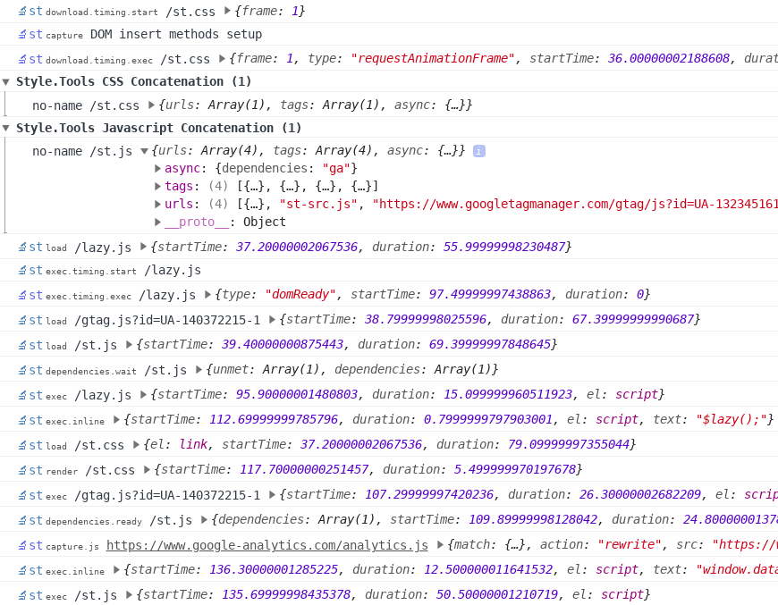

[](https://travis-ci.com/style-tools/async) [](https://github.com/style-tools/async/releases) [](http://badge.fury.io/js/%40style.tools%2Fasync) [](https://packagist.org/packages/styletools/async)

# Async CSS and Script Loader

A lightweight and high performance async CSS and script loader.

```javascript
// simple: stylesheet
$async('sheet.css').then(function() { /* ready */ });

// simple: sript
$async.js('script.js').then(function() { /* ready */ });

// advanced: load 3 stylesheets
$async(
   [
      'sheet.css', 
      {
         href:'other-sheet.css',
         dependencies: ['sheet.css'], // wait for sheet.css via dependencies and insert after DOM element
         load_timing: {
            type: "lazy", // use $lazy for timing (Intersection Observer)
            config: ["img[data-src]", 0, "200px"], // visible within 200 pixels
         },
         "ref": "other
      }, 
      {
         href:'mobile-sheet.css',
         dependencies: "other", // dependency by ref
         target: {
            after: 'meta[charset]' // control insert target
         },
         load_timing: {
            type: 'media', // download stylesheet based on a media query (works with viewport changes)
            media: 'screen and (max-width: 600px)'
         }"
      }
   ],
   {  // global options applied to all stylesheets
      base: '/long/path/to/css/', // base directory for relative sheet URLs
      cache: {
         type: "localStorage",
         max_size: 10000, // cache only <10kb
         fallback: 'cache-api', // fallback to Cache-API for bigger sheets
         update: {
            head: true, // use HTTP HEAD request to check for 304 - Not Modified
            interval: 86400 // update once per day
         },
         source: ['cssText','xhr','cors'], // default
         cors: {
            proxy: 'https://cors-anywhere.herokuapp.com/', // more proxies on https://gist.github.com/jimmywarting/ac1be6ea0297c16c477e17f8fbe51347
         },
         xhr: {
            headers: {
               "x-special-header": "secret-key" // request header to include in XHR requests
            }
         }
      },
      attributes: { 
         "data-app-sheet": "1" // HTML attribute to add to stylesheet element
      },
      render_timing: "requestAnimationFrame" // render all sheets via requestAnimationFrame
   } 
).then(function() { /* ready */ });

// chainable
$async
   .on('load',function(sheet, sheetEl){
      //  sheet.css or other-sheet.css loaded
   }) 
   .on('sheet-ref',function() { }) // sheet with ref-name loaded
   .on('sheet.css', function() {}); // sheet with href loaded
   .load({
      href: 'sheet.css', 
      ref: 'sheet-ref'
   })
   .then(function() { }) // sheet.css loaded
   .load('other-sheet.css');

// script loader
$async.js(
	[/*scripts*/],	// string, object or an array of strings or objects
	{/*options*/},			// object
	[/*capture*/],			// string, object or an array of strings or objects 
	{/*capture options*/}
) // direct access to javascript loader

// CSS and script loader combined
$async(
   [/*stylesheets*/],	// string, object or an array of strings or objects
   {/*options*/},			// object
   [/*capture*/],			// string, object or an array of strings or objects 
   {/*capture options*/}		// object

   /* 5 to 8th = javascript loader */
   [],{},[],{}
).then(function() { /* ready */ });	
```

#### Documentation is available on [docs.style.tools/async](https://docs.style.tools/async).

### Features

1. Dependency, responsive and timed download and/or render/exec.
2. [in-view](https://github.com/camwiegert/in-view) and [$lazy](https://github.com/style-tools/lazy) (element in view) based loading.
3. `requestAnimationFrame` and `requestIdleCallback` (smooth rendering/exec based on CPU)
4. Chainable and events.
5. `localStorage` or [Cache API](https://developer.mozilla.org/en-US/docs/Web/API/Cache) based loading (much faster, see [css-art.com](https://css-art.com))
6. Async injected stylesheet and script capture via `MutationObserver` or DOM insert method rewriting.
7. Fallback via `try {} catch` and `<noscript rel="css">`.
8. Google Closure Compiler with Advanced Optimizations based script compression (IIFE).
9. HTML data-attribute `data-c` based JSON config to enable Content-Security-Policy (CSP) with page-based config.
10. [Performance API](https://developer.mozilla.org/en-US/docs/Web/API/Performance) timings for debugging and optimization.

### Install via npm

```bash
npm install @style.tools/async --save
```

### Install via PHP Composer

```bash
composer require styletools/async
```

The script is optimized to achieve the minimum size possible for above the fold optimization.

<details/>
  <summary>Show script sizes of async loader modules</summary>

```text
async-core.js Size: 2.04 kb (2089 bytes) Gzip: 0.99 kb (1012 bytes).
event-emitter.js Size: 0.47 kb (482 bytes) Gzip: 0.24 kb (245 bytes).
debug.js Size: 0.13 kb (130 bytes) Gzip: 0.13 kb (135 bytes).
css-loader.js Size: 1.07 kb (1094 bytes) Gzip: 0.63 kb (646 bytes).
js-loader.js Size: 1.83 kb (1876 bytes) Gzip: 1.01 kb (1032 bytes).
inline-js.js Size: 0.38 kb (390 bytes) Gzip: 0.27 kb (278 bytes).
rebase.js Size: 0.12 kb (124 bytes) Gzip: 0.12 kb (124 bytes).
regex.js Size: 0.14 kb (142 bytes) Gzip: 0.14 kb (144 bytes).
vendor.js Size: 0.18 kb (187 bytes) Gzip: 0.17 kb (169 bytes).
api.js Size: 0.25 kb (256 bytes) Gzip: 0.18 kb (187 bytes).
dependency.js Size: 0.71 kb (727 bytes) Gzip: 0.41 kb (418 bytes).
timing.js Size: 0.71 kb (726 bytes) Gzip: 0.41 kb (415 bytes).
inview.js Size: 0.92 kb (944 bytes) Gzip: 0.55 kb (566 bytes).
responsive.js Size: 0.26 kb (267 bytes) Gzip: 0.20 kb (201 bytes).
cache.js Size: 1.35 kb (1381 bytes) Gzip: 0.76 kb (776 bytes).
cache-css.js Size: 0.32 kb (325 bytes) Gzip: 0.24 kb (242 bytes).
cache-js.js Size: 0.05 kb (55 bytes) Gzip: 0.07 kb (71 bytes).
localstorage.js Size: 0.43 kb (438 bytes) Gzip: 0.28 kb (284 bytes).
cache-api.js Size: 0.62 kb (632 bytes) Gzip: 0.34 kb (353 bytes).
xhr.js Size: 0.83 kb (849 bytes) Gzip: 0.49 kb (503 bytes).
cache-update.js Size: 0.15 kb (152 bytes) Gzip: 0.13 kb (134 bytes).
capture.js Size: 1.23 kb (1259 bytes) Gzip: 0.71 kb (723 bytes).
capture-observer.js Size: 0.26 kb (263 bytes) Gzip: 0.20 kb (208 bytes).
capture-insert.js Size: 0.34 kb (348 bytes) Gzip: 0.22 kb (224 bytes).
capture-css.js Size: 0.14 kb (141 bytes) Gzip: 0.13 kb (131 bytes).
capture-js.js Size: 0.07 kb (69 bytes) Gzip: 0.08 kb (87 bytes).
attr-config.js Size: 0.29 kb (293 bytes) Gzip: 0.22 kb (229 bytes).
```
</details>


### Demo

See `$async` in action on https://style.tools (browser console).



